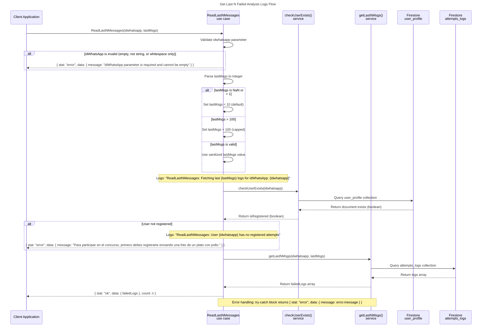

# Get Last N Messages Sequence Diagram



## Component Overview

| Component            | Role                                                              |
| -------------------- | ----------------------------------------------------------------- |
| Client Application   | Invokes ReadLastNMessages to retrieve failed analysis logs       |
| ReadLastNMessages()  | Use case orchestrator in src/application/read_last_n_messages.js  |
| checkUserExists()    | Database service in src/services/db/user_profile/check_user_exists.js |
| getLastNMsgs()       | Database service in src/services/db/get_last_n_msgs/              |
| Firestore user_profile | Stores user registration status                                 |
| Firestore attempts_logs | Stores failed analysis logs per user                           |

## Parameter Validation Rules

| Condition                  | Action                              |
| -------------------------- | ----------------------------------- |
| idWhatsApp missing/empty   | Return error immediately            |
| lastMsgs is NaN            | Default to 10                       |
| lastMsgs < 1               | Default to 10                       |
| lastMsgs > 100             | Cap at 100                          |
| 1 <= lastMsgs <= 100       | Use provided value                  |

## Response Formats

### Success Response
```json
{
  "stat": "ok",
  "data": {
    "failedLogs": [
      {
        "msg_to_dev": "Error description for developer",
        "msg_to_user": "Mensaje de error para usuario",
        "time": "2026-04-28T07:19:29.000Z"
      }
    ]
  },
  "count": 1
}
```

### Error Response
```json
{
  "stat": "error",
  "data": {
    "message": "Error description here"
  }
}
```

## Scenario Coverage

| Scenario | Path in Diagram |
| -------- | --------------- |
| Valid parameters, registered user | idWhatsApp valid → lastMsgs valid → checkUserExists → DB query → Success |
| Invalid idWhatsApp | idWhatsApp invalid → Immediate error return |
| User not registered | checkUserExists returns false → Immediate error return |
| lastMsgs not provided | lastMsgs defaults to 10 |
| lastMsgs > 100 | lastMsgs capped at 100 |
| No messages found | DB returns empty array → Success with count: 0 |
| Database error | DB throws → Error response returned |