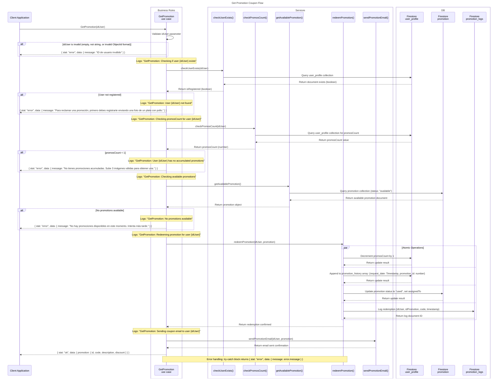

# Get Promotion Sequence Diagram



## Component Overview

| Component              | Role                                                              |
| ---------------------- | ----------------------------------------------------------------- |
| Client Application     | Invokes GetPromotion to request a coupon                          |
| GetPromotion()         | Use case orchestrator                                             |
| checkUserExists()      | Database service to verify user exists in user_profile            |
| checkPromosCount()     | Database service to get user's promosCount                         |
| getAvailablePromotion() | Database service to fetch an available promotion code            |
| redeemPromotion()       | Database service to atomically redeem promotion                   |
| sendPromotionEmail()    | Service to send coupon via email                                  |
| Firestore user_profile | Stores user data including promosCount                           |
| Firestore promotion    | Stores available/used promotion codes                             |
| Firestore promotion_logs | Stores audit log of all redemptions                              |

## Parameter Validation Rules

| Condition                | Action                              |
| ------------------------ | ----------------------------------- |
| idUser missing/empty     | Return error immediately            |
| idUser invalid ObjectId  | Return error immediately            |
| User not registered      | Return error immediately            |
| promosCount < 1          | Return error immediately            |
| No promotions available  | Return error immediately            |

## Response Formats

### Success Response
```json
{
  "stat": "ok",
  "data": {
    "promotion": {
      "id": "promotion_id",
      "code": "123456",
      "description": "Coupon description",
      "discount": "10% off"
    }
  }
}
```

### Error Response
```json
{
  "stat": "error",
  "data": {
    "message": "Error description here"
  }
}
```

## Scenario Coverage

| Scenario                     | Path in Diagram |
| ---------------------------- | --------------- |
| Valid user with promos      | Validate → User exists → promosCount >= 1 → Get promo → Redeem → Email → Success |
| Invalid idUser format        | Validate → Immediate error return |
| User not registered          | Validate → User check → Immediate error return |
| User has no promos (0)       | Validate → User exists → promosCount check → Immediate error return |
| No promotions available     | Validate → User exists → promosCount >= 1 → Get promo → No promo available → Error |
| Database error               | DB throws → Error response returned |
| Email sending fails          | Redeem succeeds → Email fails → Error logged, redemption completed |

## Business Rules

1. **Accumulation**: 1 promotion per 3 valid image uploads
2. **Redemption**: Only one promotion can be redeemed at a time
3. **Atomicity**: Redemption operations (decrement count, update status, log) are atomic
4. **Logging**: All redemption attempts are logged for audit
5. **Email**: Coupon sent in format with ID + 6-digit code