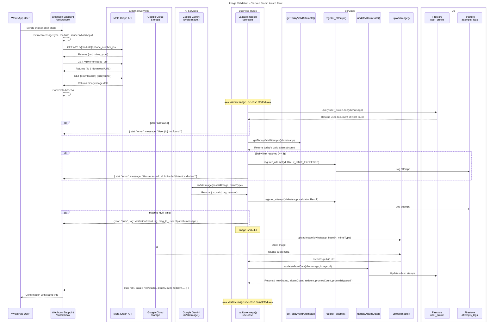
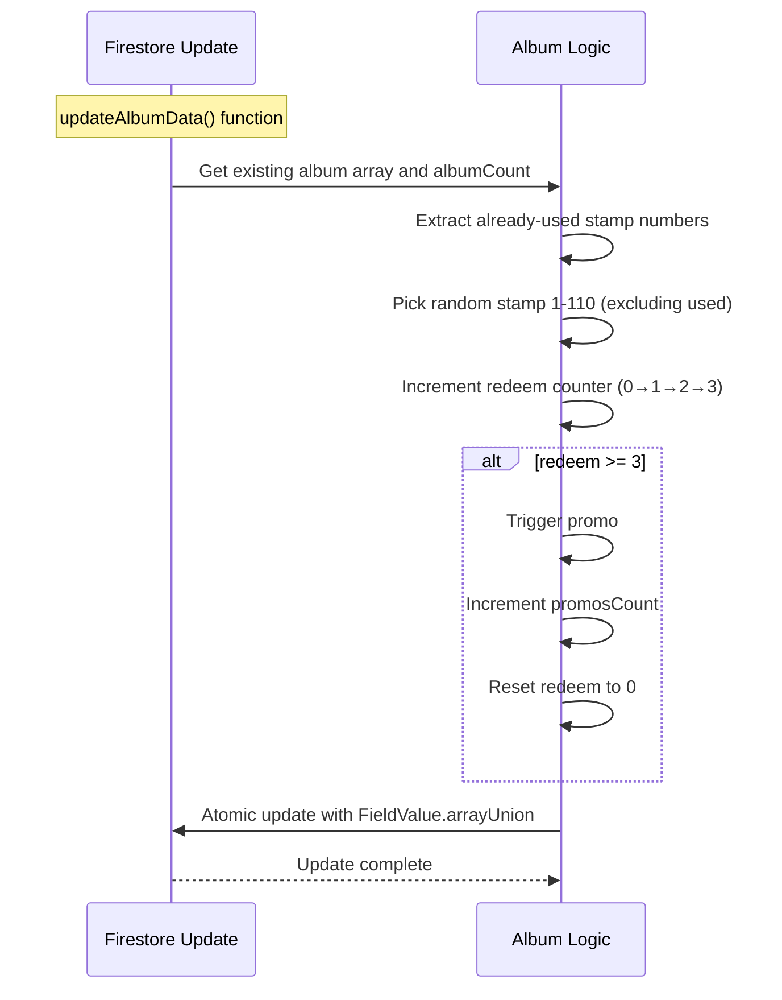

# Image Validation Sequence Diagram

## Component Overview

### External Services / Adapters
| Component               | Role                                                           |
| ----------------------- | -------------------------------------------------------------- |
| WhatsApp User           | Sends image via WhatsApp messaging                             |
| Webhook Endpoint        | Receives and processes WhatsApp webhook events                 |
| Meta Graph API          | Provides image download URL and image binary data              |
| Google Cloud Storage    | Stores uploaded images with public URL                         |

### AI Services
| Component               | Role                                                           |
| ----------------------- | -------------------------------------------------------------- |
| Google Gemini AI        | Validates if image contains prepared chicken dish              |

### Business Rules
| Component               | Role                                                           |
| ----------------------- | -------------------------------------------------------------- |
| validateImage()         | Main use case orchestrator (src/application/validate_image.js) |

### Services
| Component               | Role                                                           |
| ----------------------- | -------------------------------------------------------------- |
| getTodayValidAttempts() | Checks user's valid attempts for today                         |
| register_attempt()      | Logs validation attempts to attempts_logs collection           |
| updateAlbumData()       | Updates album stamps and promo logic                           |
| uploadImage()           | Uploads image to Google Cloud Storage                           |

### DB (Firestore Collections)
| Component               | Role                                                           |
| ----------------------- | -------------------------------------------------------------- |
| user_profile            | Stores user data, album stamps, redeem counter                 |
| attempts_logs           | Logs all validation attempts with tags                         |

## Validation Tags

| Tag                                     | Description                            |
| --------------------------------------- | -------------------------------------- |
| `VALID`                                 | Image contains a prepared chicken dish |
| `NOT_FOOD_OR_CHICKEN`                   | Image is food but not chicken          |
| `STOCK_OR_INTERNET_IMAGERY`             | Stock or internet photo detected       |
| `AI_GENERATED_OR_MANIPULATED`           | Synthetic or AI-generated image        |
| `ADVERTISEMENTS_OR_COMMERCIAL_DISPLAYS` | Commercial promotional content         |
| `LIVE_ANIMALS`                          | Live chicken (not prepared food)       |
| `DAILY_LIMIT_EXCEEDED`                  | User exceeded 3 valid attempts today   |

## Promo Trigger Logic

